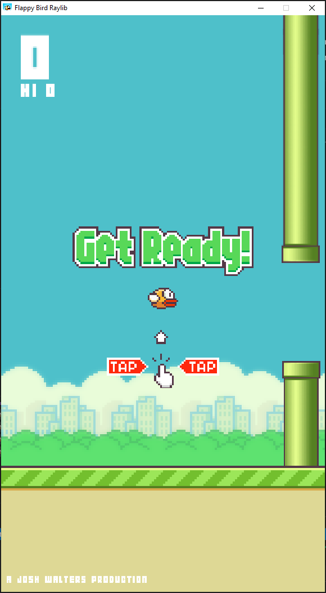

# FlappyBird-CPP

FlappyBird-CPP is a fast-paced, fun, and interactive Flappy Bird clone coded in C++ using the Raylib graphics library. Designed as a personal project by Josh Walters, it combines smooth gameplay mechanics with engaging visuals and sound effects.

## 🎮 Features

* Fully playable Flappy Bird clone
* Smooth, physics-based movement and rotation
* Dynamic obstacles with random heights
* Audio effects: wing flap, point scored, collision, and game over
* Score tracking and high score display
* Customizable textures and sprites
* Built with Raylib, easy to extend for new features

## ⚡ Tech Stack

* **Languages:** C++
* **Libraries / Frameworks:** Raylib
* **Tools:** Visual Studio, VS Code

## 🛠 Installation

1. Clone the repository:

```bash
git clone https://github.com/Joshua-Walters/FlappyBird-CPP.git
cd FlappyBird-CPP
```

### Install Raylib (for your system)

* **Windows:** Use vcpkg or download precompiled binaries
* **Linux:** `sudo apt install libraylib-dev`
* **macOS:** `brew install raylib`

### Build the project

```bash
g++ main.cpp -o FlappyBird -lraylib -lopengl -lm -lpthread -ldl -lrt -lX11
```

### Run the game

```bash
./FlappyBird
```

## 🎨 Assets

All game assets (sprites, fonts, sounds) are included in the `assets/` folder:

* **Bird sprites:** bird, up, down
* **Environment:** pipes, flipped pipes, extend textures, old tent
* **Sounds:** wing, point, hit, die
* **Fonts:** Flappy font for score display

## 🏗 Gameplay Mechanics

* Click the mouse or press `SPACE` to make the bird flap.
* Avoid pipes and obstacles to score points.
* Game ends on collision or falling to the ground.
* Press `C` to restart after a game over.

## 🌟 Notes

This project is a self-taught C++ exercise exploring Raylib, object-oriented programming, and game development.
Optimized for learning and experimentation—feel free to fork and extend it!

## 📺 Demo



## ⚡ Quote

> “Code is like humor. When you have to explain it, it’s bad.” – Cory House

Made with Work by Josh Walters | Computer Engineering Enthusiast | Australia
